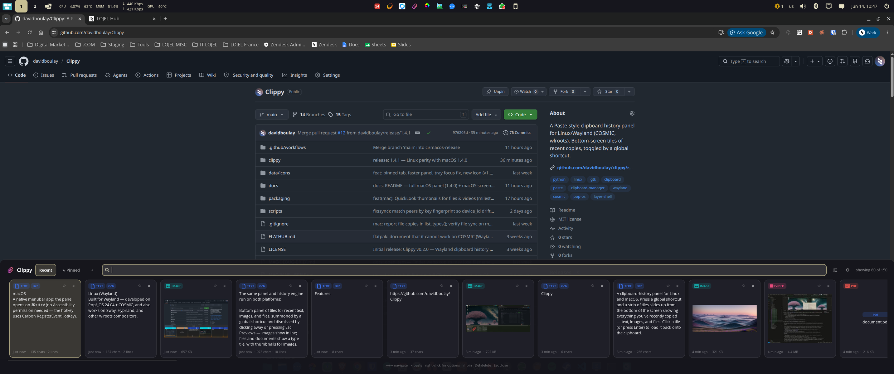
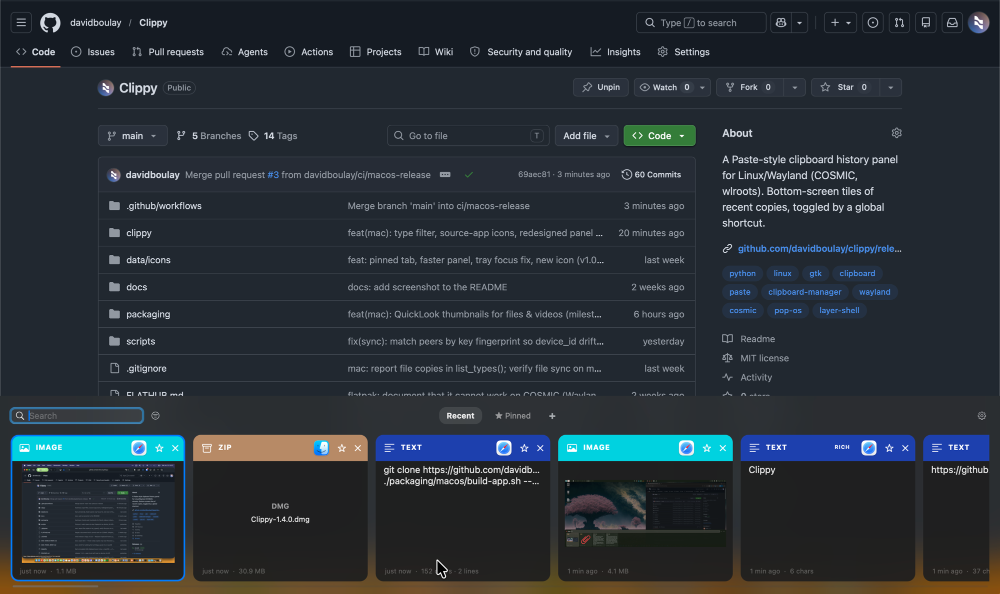

# Clippy

A clipboard-history panel for **Linux and macOS**. Press a global shortcut and a
strip of tiles slides up from the bottom of the screen showing everything you've
recently copied — text, images, and files. Click a tile (or press <kbd>Enter</kbd>)
to load it back onto the clipboard.

Clippy stays out of your way — a **paperclip in the menubar / system tray**,
never in the dock — and adds **end-to-end-encrypted LAN sync** so your clipboard
follows you between machines, even across operating systems.

| Linux (Wayland / COSMIC) | macOS |
|---|---|
|  |  |

## Features

The same panel and history engine run on both platforms:

- **Bottom panel of tiles** for recent text, images, and files, summoned by a
  global shortcut and dismissed by clicking away or pressing <kbd>Esc</kbd>.
- **Previews** — images show inline; files and documents show a type tile, with
  thumbnails for images, videos, PDFs and docs.
- **Pin** items so they survive pruning and sort first; **search** by typing;
  **keyboard navigation** and quick-select.
- **Tabs** — *Recent*, *★ Pinned*, and your own **colored, named custom tabs**;
  pin a clip and choose which tab it lands in.
- **Type filter** — show only one kind at a time (text / image / video / audio /
  PDF / spreadsheet / archive / other), with per-type colored badges.
- **Plain vs. rich paste** — strip formatting, or keep it when the source had it.
  Right-click a tile to copy as plain text.
- **History retention** — keep for *1 day / 1 week / 1 month / 1 year / forever*,
  with automatic pruning, plus a manual *Clear history*.
- **Live updates** — an open panel refreshes as new clips arrive, including ones
  pushed from a synced peer.
- **Follows the OS light/dark theme** automatically.
- **Encrypted LAN sync** (opt-in) — share the clipboard across paired devices:
  text, images, and **any file**, with previews and a size cap you control.
- **Local-only storage** — SQLite + files under your data dir; nothing leaves
  your machine unless you pair devices for sync.

Each platform integrates natively:

- **Linux:** a system-tray paperclip, automatic **COSMIC shortcut binding**, and
  a full-screen click-away overlay.
- **macOS:** a menubar paperclip, **QuickLook** thumbnails, and the **icon of the
  app each clip came from** on every tile (a Wayland security boundary makes that
  last one macOS-only — see [Limitations](#limitations)).

## Get Clippy

### Linux (Wayland)

Built for **Wayland** — developed on **Pop!_OS 24.04 + COSMIC**, and also works
on Sway, Hyprland, and other wlroots compositors.

**Ubuntu / Pop!_OS / Debian — APT repository (recommended)** — add the repo once,
then install and get updates with `apt` like any system package:

```bash
curl -fsSL https://davidboulay.github.io/Clippy/clippy.gpg | sudo tee /usr/share/keyrings/clippy.gpg >/dev/null
echo "deb [signed-by=/usr/share/keyrings/clippy.gpg] https://davidboulay.github.io/Clippy ./" | sudo tee /etc/apt/sources.list.d/clippy.list
sudo apt update && sudo apt install clippy
```

New versions then arrive with `sudo apt upgrade`. The repo is GPG-signed and
served over GitHub Pages.

**Or grab the `.deb` directly** from the
**[Releases page](https://github.com/davidboulay/clippy/releases/latest)**:

```bash
gh release download --repo davidboulay/clippy --pattern '*.deb'
sudo apt install ./clippy_*.deb
```

`apt` pulls in the dependencies. Then launch **Clippy** from your app list, open
**Settings**, and bind a shortcut (see [below](#set-the-linux-shortcut)).

**Other distributions**

- **Arch / Manjaro:** `cd packaging/arch && makepkg -si`
- **AppImage** (experimental, any distro): `make appimage`, then run `dist/Clippy-*.AppImage`
- **From source:** `git clone … && cd clippy && ./scripts/install.sh` — installs
  deps, a `~/.local/bin/clippy` launcher + icon, enables autostart, and starts
  the daemon. Build a `.deb` instead with `make deb` (see
  [`packaging/README.md`](packaging/README.md)).
- **Flatpak / COSMIC Store:** ❌ not viable — COSMIC withholds the privileged
  `layer-shell` and `data-control` Wayland protocols from Flatpak-sandboxed apps,
  which Clippy requires. Details in [`FLATHUB.md`](FLATHUB.md).

Dependencies (handled by the `.deb`): `wl-clipboard`, `python3-gi`,
`gir1.2-gtk-3.0`, `gir1.2-gtklayershell-0.1`, `libgtk-layer-shell0`,
`gir1.2-ayatanaappindicator3-0.1`, `libayatana-appindicator3-1`, `pipewire-bin`,
plus `python3-nacl` + `python3-zeroconf` for sync (`poppler-utils` for PDF
thumbnails — pulled in via Recommends; `ffmpeg` optional for video thumbnails;
`xclip` optional, to paste images/files into XWayland apps).

#### Set the Linux shortcut

Open the tray icon → **Settings** (or the ⚙ in the panel), click the shortcut
button, and press your combo (e.g. <kbd>Super</kbd>+<kbd>V</kbd>). Clippy writes
the COSMIC binding for you, keeping a backup of your existing shortcuts. To do it
from the terminal: `clippy setup-shortcut`.

> Tray not showing? Ensure COSMIC's **Status Area / applet** is on your panel.
> Either way, the panel's ⚙ opens Settings and the shortcut still works.

### macOS

A native menubar app; the panel opens on <kbd>⌘</kbd>+<kbd>⇧</kbd>+<kbd>V</kbd>
(no Accessibility permission needed — the hotkey uses Carbon `RegisterEventHotKey`).

Grab `Clippy-<ver>.dmg` from the
**[Releases page](https://github.com/davidboulay/clippy/releases/latest)** and
drag Clippy to *Applications*. Or build it yourself on a Mac:

```bash
git clone https://github.com/davidboulay/clippy.git && cd clippy
./packaging/macos/build-app.sh --dmg      # → dist/Clippy.app and dist/Clippy-<ver>.dmg
```

The build is **ad-hoc signed** (no Apple Developer ID), so the first launch needs
**right-click → Open** once (or `xattr -dr com.apple.quarantine /Applications/Clippy.app`).
See [`packaging/macos/README.md`](packaging/macos/README.md).

**Updating:** open **Settings → Check for updates**. When a newer release exists
the button becomes **Download \<version\>** — clicking it downloads the new
`.dmg`, swaps the app in place, and relaunches automatically (no manual
re-download or drag). The Linux `.deb` updates the same way via *Settings →
Check for updates*.

## Using the panel

| Action | Linux | macOS |
|---|---|---|
| Open / close the panel | your COSMIC shortcut | <kbd>⌘</kbd>+<kbd>⇧</kbd>+<kbd>V</kbd> |
| Search history | type | type |
| Move between tiles | <kbd>←</kbd>/<kbd>→</kbd>/<kbd>↑</kbd>/<kbd>↓</kbd> | <kbd>←</kbd>/<kbd>→</kbd> |
| Copy selected & close | <kbd>Enter</kbd> | <kbd>Enter</kbd> |
| Copy the Nth tile | <kbd>Ctrl</kbd>+<kbd>1…9</kbd> | <kbd>⌘</kbd>+<kbd>1…9</kbd> |
| Pin / unpin selected | <kbd>Ctrl</kbd>+<kbd>P</kbd> | <kbd>⌘</kbd>+<kbd>P</kbd> |
| Delete selected | <kbd>Delete</kbd> | <kbd>⌘</kbd>+<kbd>⌫</kbd> |
| Close | <kbd>Esc</kbd> / click away | <kbd>Esc</kbd> / click away |
| Copy as plain text | right-click tile | right-click tile |

Selecting a tile sets the clipboard — then paste with <kbd>Ctrl</kbd>/<kbd>⌘</kbd>+<kbd>V</kbd>
yourself (Clippy never injects keystrokes).

## Cross-device clipboard sync

### Why it exists, and who it's for

Most clipboard sync is either locked to one ecosystem or routed through a cloud:

- **Apple Universal Clipboard** only works between Apple devices signed in to the
  **same Apple ID**, over Continuity.
- **Cloud clipboard managers** copy your clipboard — passwords, tokens, snippets —
  onto someone else's servers.

Clippy's sync is **local-first and end-to-end encrypted**: devices talk directly
to each other on your own network, with no cloud and no account. It's built for
the setups Universal Clipboard can't cover:

- A **Linux machine and a Mac** (or any mix) — copy on one, paste on the other.
- **Two Apple devices on different Apple IDs** — e.g. a work Mac and a personal
  Mac — where Continuity won't bridge them.
- Anyone who simply doesn't want clipboard contents leaving their LAN.

If all your devices are Apple and share one Apple ID, you may not need this —
Continuity already does it. Clippy's sync is for everyone else.

### How it works

- **What syncs:** text, images, and **any file** (video, PDF, …). Files arrive as
  the real file (right name + type); images and videos show a preview tile.
- **Discovery:** automatic via mDNS (zeroconf); falls back to a manual IP if your
  network blocks multicast.
- **Security:** each device has a long-term **X25519** identity key (stored
  `0600`). **Pairing is confirmed with a 6-digit code**, so a man-in-the-middle
  can't slip in a key. Every payload is encrypted + authenticated with **NaCl**.
  Only paired devices are accepted, and traffic never leaves the LAN. Trust is
  keyed to the stable identity key, so it survives a device's id changing.
- **Size cap:** default **512 MiB**, raise up to **2 GiB** (enforced on both
  ends). Transfers over ~5 MiB show a progress bar on the sender.

### Enable & pair

1. Turn on sync: **Linux** — *Settings → Sync*, then restart Clippy; **macOS** —
   *Settings → Device sync*.
2. On one device: **Show pairing code** (Linux CLI: `clippy pair`).
3. On the other: **Enter code** (Linux CLI: `clippy pair <code>`, or
   `clippy pair <code> <ip>` if multicast is blocked).

That's it — the macOS *Device sync* pane and `clippy peers` list paired devices,
and either side can **unpair** later.

## How it's built

Same portable core (history, clipboard I/O, sync) on both platforms; the panel
and OS integration use each platform's native mechanisms. macOS lets an app float
a window over everything and grab a global hotkey; Wayland — by design — does
not, so the Linux side uses the native Wayland protocols.

| Need | Linux (Wayland) | macOS |
|------|-----------------|-------|
| Panel pinned to the screen edge | **wlr-layer-shell** (`gtk-layer-shell`) | borderless **NSPanel** at pop-up-menu window level |
| Watch the clipboard | **`wl-paste --watch`** (`ext-data-control`) | **`NSPasteboard`** polling |
| Global hotkey | a **COSMIC custom shortcut** running `clippy toggle` | **Carbon `RegisterEventHotKey`** (⌘⇧V) |
| Menubar / tray presence | **StatusNotifierItem** (Ayatana AppIndicator) | **`NSStatusItem`** |
| UI toolkit | **GTK 3** (PyGObject) | **AppKit** (PyObjC) |
| Theme | reads COSMIC's `is_dark` | `NSAppearance` light/dark |
| Storage | **SQLite** + files under `~/.local/share/clippy` | same (shared core) |

On Linux, one binary plays several roles:

```
clippy daemon    # tray + overlay panel + IPC server + clipboard watcher
clippy toggle    # tiny client → tells the daemon to open/close (your shortcut runs this)
clippy settings  # open the settings window
clippy _store    # internal: wl-paste runs this on every clipboard change
```

The shortcut → `toggle` → Unix socket → daemon path is what lets a global key
open the panel without any forbidden hotkey grab. On macOS the menubar app hosts
the panel directly.

## Configuration & data

Everything stays local under `~/.local/share/clippy` (Linux) / the app's data
dir (macOS):

- `history.db` — SQLite history (text + rich html inline)
- `images/`, `files/`, `received/`, `thumbs/` — copied images, file payloads,
  files received from peers, and cached previews
- `identity.key` (`0600`) + `peers.json` — sync identity key and trusted devices
- `copy.wav` — synthesized copy sound

Preferences live in `settings.json` (Linux: `~/.config/clippy/`), edited via the
Settings window. Fixed limits/geometry are in `clippy/config.py`. On Linux,
`./scripts/uninstall.sh --purge` removes everything, and a backup of your COSMIC
shortcuts is kept the first time Clippy edits them.

## Limitations

- **No auto-paste.** Selecting a tile sets the clipboard; you press
  <kbd>Ctrl</kbd>/<kbd>⌘</kbd>+<kbd>V</kbd> yourself.
- **Plain/rich** uses `text/html` for the rich case; plain-only apps still get
  plain text via the plain-text path.
- **Linux** needs a compositor with `wlr-layer-shell` **and**
  `ext-/wlr-data-control` (COSMIC, Sway, Hyprland); a plain GNOME Wayland session
  lacks layer-shell. The panel appears on the active output.
- **Source-app icons are macOS-only.** macOS records the frontmost app at copy
  time and shows its icon on each tile. Wayland deliberately denies apps any way
  to query the active/foreground window or its app id (a security boundary), and
  there is no COSMIC portal for it — so this can't be supported in a Wayland
  session. The Linux tiles show the clip's type badge instead.
- **macOS** builds are ad-hoc signed (no Developer ID), so Gatekeeper shows
  "unidentified developer" on first launch.

## Project layout

```
clippy/
  cli.py             subcommand dispatch (Linux)
  daemon.py          AppController: tray + panel + settings + IPC + retention
  panel.py           Linux overlay panel, tiles, context menu, plain/rich paste
  settings_window.py Linux settings UI + shortcut capture
  tray.py            AppIndicator tray icon
  mac_app.py         macOS menubar app + global hotkey
  mac_panel.py       macOS clipboard-history panel (tiles, tabs, filter, QuickLook)
  mac_settings.py    macOS settings window
  mac_source.py      macOS per-clip source-app map (Wayland has no equivalent)
  tabs.py            shared custom tabs store (tabs.json)  ·  mac_tabs.py alias
  clip_types.py      shared clip type classifier (label + key + icon)
  capture.py         read clipboard → storage (+ sound, retention)
  clipboard.py       backend dispatch (text/image/file read + write)
  backends/          per-OS clipboard: wayland.py (wl-*) + mac.py (NSPasteboard)
  sync.py            encrypted LAN sync engine (mDNS, pairing, streamed media)
  progress.py        sender transfer-progress window (large media)
  storage.py         SQLite history (+ html column, files, time retention)
  settings.py        JSON preferences
  theme.py           COSMIC light/dark → generated GTK CSS
  sound.py           synthesize + play the copy sound
  setup.py           autostart + COSMIC shortcut editing
  ipc.py             Unix-socket control channel
  config.py          paths & limits
packaging/           deb · arch · appimage · macos (py2app) builders
scripts/install.sh · scripts/uninstall.sh · data/icons/clippy.png
```

## License

MIT
