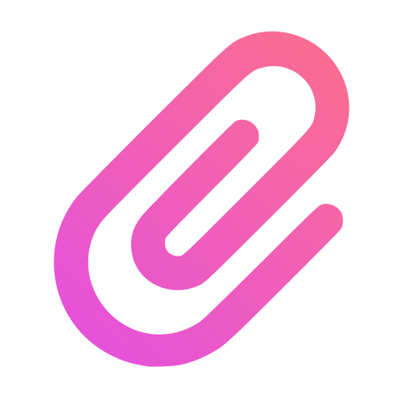
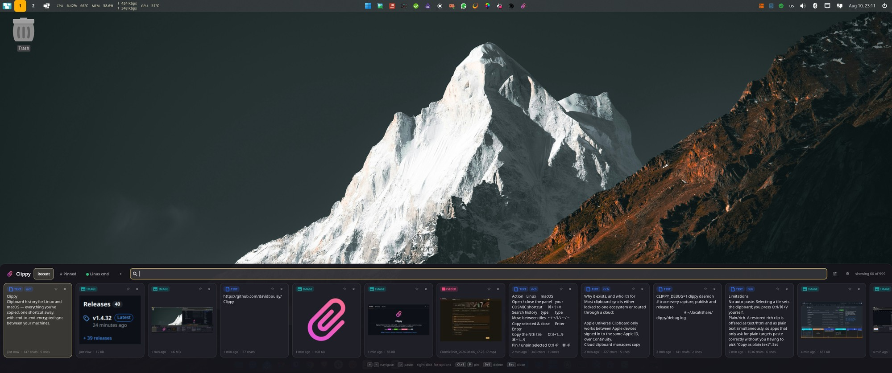
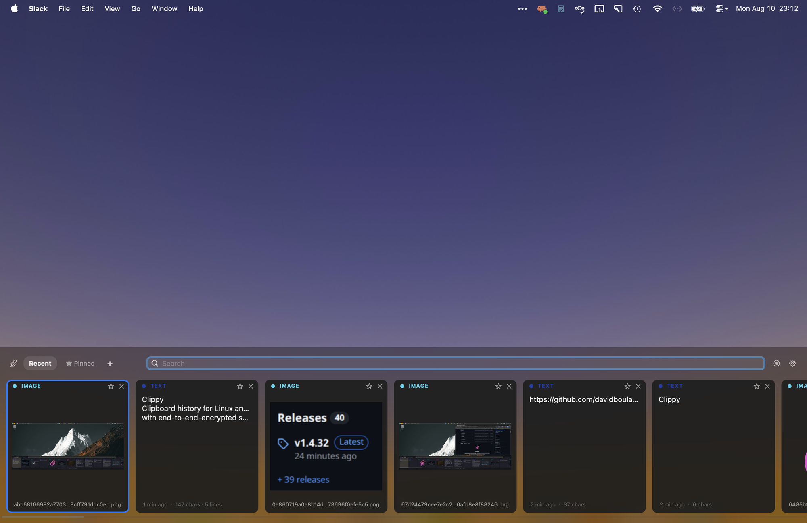

<div align="center">



<h1>Clippy</h1>

**Clipboard history for Linux and macOS** — everything you've copied, one shortcut away,<br>
with end-to-end-encrypted sync between your machines.

[](https://github.com/davidboulay/Clippy/releases/latest)
[](https://github.com/davidboulay/Clippy/actions/workflows/ci.yml)
[](#get-clippy)
[](LICENSE)

[**Install**](#get-clippy) · [Features](#features) · [Shortcuts](#using-the-panel) · [Device sync](#cross-device-clipboard-sync) · [Troubleshooting](#when-a-clip-wont-paste) · [Security](SECURITY.md)

</div>

<br>

Press a global shortcut and a strip of tiles slides up from the bottom of the
screen showing everything you've recently copied — text, images, and files.
Click a tile, or press <kbd>Enter</kbd>, to load it back onto the clipboard.

It stays out of your way: a **paperclip in the menubar or system tray**, never in
the dock. And because the same history engine runs on both platforms, an
**end-to-end-encrypted LAN sync** keeps your clipboard with you as you move
between machines — including between Linux and macOS.



<sub>**Linux** — Wayland, here on COSMIC. Custom tabs, type badges, and the shortcut bar along the bottom. The panel looks the same on Hyprland/Omarchy, in that desktop's own theme colours.</sub>



<sub>**macOS** — the same panel, showing clips that synced over from the Linux machine above.</sub>

## Features

The same panel and history engine run on both platforms:

- **Bottom panel of tiles** for recent text, images, and files, summoned by a
  global shortcut and dismissed by clicking away or pressing <kbd>Esc</kbd>.
- **Previews** — images show inline; files and documents show a type tile, with
  thumbnails for images, videos, PDFs and docs.
- **Pin** items so they survive pruning and sort first; **search** by typing;
  **keyboard navigation** and quick-select.
- **Tabs** — *Recent*, *★ Pinned*, and your own **colored, named custom tabs**;
  pin a clip and choose which tab it lands in.
- **Type filter** — show only one kind at a time (text / image / video / audio /
  PDF / spreadsheet / archive / other), with per-type colored badges.
- **Plain vs. rich paste** — strip formatting, or keep it when the source had it.
  Right-click a tile to copy as plain text.
- **History retention** — keep for *1 day / 1 week / 1 month / 1 year / forever*,
  with automatic pruning, plus a manual *Clear history*.
- **Live updates** — an open panel refreshes as new clips arrive, including ones
  pushed from a synced peer.
- **Follows the OS light/dark theme** automatically.
- **Encrypted LAN sync** (opt-in) — share the clipboard across paired devices:
  text, images, and **any file**, with previews and a size cap you control.
- **Local-only storage** — SQLite + files under your data dir; nothing leaves
  your machine unless you pair devices for sync.
- **Diagnosable** — `clippy types` shows what the clipboard is actually offering
  and how Clippy would file it; `CLIPPY_DEBUG=1` traces every capture and
  restore. See [When a clip won't paste](#when-a-clip-wont-paste).

Each platform integrates natively:

- **Linux:** a system-tray paperclip, a full-screen click-away overlay, and a
  shortcut Clippy **binds for you** in your desktop's own config — COSMIC's
  custom shortcuts, or Hyprland/Omarchy's `bindings.lua`. It follows that
  desktop's light/dark mode *and* its palette.
- **macOS:** a menubar paperclip, **QuickLook** thumbnails, and the **icon of the
  app each clip came from** on every tile (a Wayland security boundary makes that
  last one macOS-only — see [Limitations](#limitations)).

## Get Clippy

### Linux

**Requires Wayland** — specifically a compositor offering `wlr-layer-shell` and
`ext-`/`wlr-data-control`. COSMIC, Hyprland and Sway all qualify; a plain GNOME
Wayland session does not. Developed on **Pop!_OS 24.04 + COSMIC** and
**Omarchy 4 (Arch + Hyprland)**.

Two independent things decide your setup, so they're covered separately below:
**your distro picks the package**, and **your desktop picks the integration** —
where the shortcut is written, which tray hosts the paperclip, which theme
Clippy follows. Arch with COSMIC and Debian with Hyprland are both fine.

#### Install — Debian / Ubuntu / Pop!_OS

**APT repository (recommended)** — add it once, then install and update with
`apt` like any system package:

```bash
curl -fsSL https://davidboulay.github.io/Clippy/clippy.gpg | sudo tee /usr/share/keyrings/clippy.gpg >/dev/null
echo "deb [signed-by=/usr/share/keyrings/clippy.gpg] https://davidboulay.github.io/Clippy ./" | sudo tee /etc/apt/sources.list.d/clippy.list
sudo apt update && sudo apt install clippy
```

New versions then arrive with `sudo apt upgrade`. The repo is GPG-signed and
served over GitHub Pages. Or grab the `.deb` directly from the
**[Releases page](https://github.com/davidboulay/clippy/releases/latest)**:

```bash
gh release download --repo davidboulay/clippy --pattern '*.deb'
sudo apt install ./clippy_*.deb
```

#### Install — Arch / Manjaro

Omarchy, EndeavourOS and the other Arch derivatives are covered here too — they
share `pacman`, and nothing in the package is derivative-specific.

There is no published binary package or AUR entry yet, so build it from the
tree — `makepkg` does the work and `pacman` resolves the dependencies:

```bash
git clone https://github.com/davidboulay/Clippy.git && cd Clippy
make arch                                    # → packaging/arch/clippy-<ver>-any.pkg.tar.zst
sudo pacman -U packaging/arch/clippy-*.pkg.tar.zst
```

Everything Clippy needs is in the official repos — nothing from the AUR. The
package is `arch=('any')`: it installs to `/usr/lib/clippy` rather than
site-packages, so an Arch Python minor bump can't break it.

Optional features are `optdepends`, left out of a minimal install. For LAN sync:

```bash
sudo pacman -S python-pynacl python-zeroconf python-spake2
```

**Updating:** rebuild and `pacman -U` again. Clippy will *not* try to update
itself here — it detects a pacman install and shows the command to run instead
of an install button, because driving `apt` over a pacman install would corrupt
both package databases.

#### Other distributions

- **From source (any Wayland distro):** `git clone … && cd Clippy && ./scripts/install.sh`
  — detects `pacman`, `apt-get` or `dnf`, installs the dependencies, drops a
  `~/.local/bin/clippy` launcher + icon, enables autostart and starts the daemon.
- **AppImage** (experimental): `make appimage`, then run `dist/Clippy-*.AppImage`.
- **Flatpak / COSMIC Store:** ❌ not viable — COSMIC withholds the privileged
  `layer-shell` and `data-control` Wayland protocols from Flatpak-sandboxed apps,
  which Clippy requires. Details in [`FLATHUB.md`](FLATHUB.md).

#### Dependencies

Your package manager handles these; the list is here for source installs.

| | Arch | Debian / Ubuntu |
|---|---|---|
| **Required** | `python-gobject` `gtk3` `gtk-layer-shell` `libayatana-appindicator` `wl-clipboard` | `python3-gi` `gir1.2-gtk-3.0` `gir1.2-gtklayershell-0.1` `libgtk-layer-shell0` `gir1.2-ayatanaappindicator3-0.1` `libayatana-appindicator3-1` `wl-clipboard` |
| **LAN sync** | `python-pynacl` `python-zeroconf` `python-spake2` | `python3-nacl` `python3-zeroconf` `python3-spake2` |
| **Copy sound** | `pipewire` or `libpulse` | `pipewire-bin` or `pulseaudio-utils` |
| **Notifications** | `libnotify` | `libnotify-bin` |
| **Thumbnails** | `ffmpeg` (video), `poppler` (PDF) | `ffmpeg`, `poppler-utils` |
| **XWayland paste fallback** | `xclip`, `gtk4` | `xclip`, `libgtk-4-1` |

#### Desktop integration — shortcut, tray, theme

This part follows your **desktop**, not your distro. `clippy status` prints the
one it detected.

**Shortcut.** Open the tray icon → **Settings** (or the ⚙ in the panel), click
the shortcut button, and press your combo. Clippy writes the binding into
whichever config your desktop actually reads:

| Desktop | Where the binding goes |
|---|---|
| **COSMIC** | `~/.config/cosmic/…/Shortcuts/v1/custom`, with a one-time backup of your existing shortcuts |
| **Omarchy** | a marked block in `~/.config/hypr/bindings.lua`, then `hyprctl reload` |
| **Hyprland** (plain) | `~/.config/hypr/clippy.conf`, sourced once from `hyprland.conf`, then `hyprctl reload` |
| anything else | nothing is written — `clippy setup-shortcut` prints what to bind by hand |

To see the steps for your desktop from the terminal: `clippy setup-shortcut`.

> **On Omarchy, pick a free key.** <kbd>Super</kbd>+<kbd>V</kbd> is *Universal
> paste* and <kbd>Super</kbd>+<kbd>Ctrl</kbd>+<kbd>V</kbd> is Omarchy's own
> clipboard manager. <kbd>Super</kbd>+<kbd>Shift</kbd>+<kbd>V</kbd> is free by
> default. Check with `omarchy menu keybindings --print`; Clippy emits an
> `hl.unbind` above its own bind, so it overrides cleanly if you do reuse a key.

**Tray.** The paperclip needs an SNI host on your panel — COSMIC's **Status
Area** applet, or the `omarchy.tray` widget in `~/.config/omarchy/shell.json`
(it ships enabled). Without one the panel's ⚙ still opens Settings and the
shortcut still works.

**Theme.** Clippy follows the desktop's light/dark **and** its palette: COSMIC's
theme files, or the active Omarchy theme's `colors.toml`; anything else falls
back to the XDG portal for light/dark and Clippy's built-in palette. A running
Clippy restyles itself when you switch themes — no restart.

### macOS

A native menubar app; the panel opens on <kbd>⌘</kbd>+<kbd>⇧</kbd>+<kbd>V</kbd>
(no Accessibility permission needed — the hotkey uses Carbon `RegisterEventHotKey`).

Grab `Clippy-<ver>.dmg` from the
**[Releases page](https://github.com/davidboulay/clippy/releases/latest)** and
drag Clippy to *Applications*. Or build it yourself on a Mac:

```bash
git clone https://github.com/davidboulay/clippy.git && cd clippy
./packaging/macos/build-app.sh --dmg      # → dist/Clippy.app and dist/Clippy-<ver>.dmg
```

The build is **ad-hoc signed** (no Apple Developer ID), so the first launch needs
**right-click → Open** once (or `xattr -dr com.apple.quarantine /Applications/Clippy.app`).
See [`packaging/macos/README.md`](packaging/macos/README.md).

**Updating:** open **Settings → Check for updates**. When a newer release exists
the button becomes **Download \<version\>** — clicking it downloads the new
`.dmg`, swaps the app in place, and relaunches automatically (no manual
re-download or drag). A Linux `.deb` install updates the same way via *Settings
→ Check for updates*; a pacman or source install shows the command to run
instead, since only the `.deb` can be upgraded safely from inside the app.

## Using the panel

| Action | Linux | macOS |
|---|---|---|
| Open / close the panel | your shortcut (see [above](#desktop-integration--shortcut-tray-theme)) | <kbd>⌘</kbd>+<kbd>⇧</kbd>+<kbd>V</kbd> |
| Search history | type | type |
| Move between tiles | <kbd>←</kbd>/<kbd>→</kbd>/<kbd>↑</kbd>/<kbd>↓</kbd> | <kbd>←</kbd>/<kbd>→</kbd> |
| Copy selected & close | <kbd>Enter</kbd> | <kbd>Enter</kbd> |
| Copy the Nth tile | <kbd>Ctrl</kbd>+<kbd>1…9</kbd> | <kbd>⌘</kbd>+<kbd>1…9</kbd> |
| Pin / unpin selected | <kbd>Ctrl</kbd>+<kbd>P</kbd> | <kbd>⌘</kbd>+<kbd>P</kbd> |
| Delete selected | <kbd>Delete</kbd> | <kbd>⌘</kbd>+<kbd>⌫</kbd> |
| Close | <kbd>Esc</kbd> / click away | <kbd>Esc</kbd> / click away |
| Copy as plain text | right-click tile | right-click tile |

Selecting a tile sets the clipboard — then paste with <kbd>Ctrl</kbd>/<kbd>⌘</kbd>+<kbd>V</kbd>
yourself (Clippy never injects keystrokes).

"Click away" works differently per compositor, and it shows. On cosmic-comp the
panel is a bottom strip that leaves the rest of the screen live: it closes when
your click moves the keyboard focus, and that click still lands where you aimed
it. On wlroots compositors (Hyprland/Omarchy) focus is no signal — it follows
the mouse and it follows window activation, so a panel that trusted it vanished
when the pointer merely crossed a window and stayed put when you clicked the
window that already had focus. There the panel covers the screen instead,
invisible except for the strip, and reads the click itself — so the click that
dismisses it is consumed, and the bar is not clickable while it is open.

## Cross-device clipboard sync

### Why it exists, and who it's for

Most clipboard sync is either locked to one ecosystem or routed through a cloud:

- **Apple Universal Clipboard** only works between Apple devices signed in to the
  **same Apple ID**, over Continuity.
- **Cloud clipboard managers** copy your clipboard — passwords, tokens, snippets —
  onto someone else's servers.

Clippy's sync is **local-first and end-to-end encrypted**: devices talk directly
to each other on your own network, with no cloud and no account. It's built for
the setups Universal Clipboard can't cover:

- A **Linux machine and a Mac** (or any mix) — copy on one, paste on the other.
- **Two Apple devices on different Apple IDs** — e.g. a work Mac and a personal
  Mac — where Continuity won't bridge them.
- Anyone who simply doesn't want clipboard contents leaving their LAN.

If all your devices are Apple and share one Apple ID, you may not need this —
Continuity already does it. Clippy's sync is for everyone else.

### How it works

- **What syncs:** text, images, and **any file** (video, PDF, …). Files arrive as
  the real file (right name + type); images and videos show a preview tile.
- **Discovery:** automatic via mDNS (zeroconf); falls back to a manual IP if your
  network blocks multicast.
- **Security:** each device has a long-term **X25519** identity key (stored
  `0600`). **Pairing runs SPAKE2** (a password-authenticated key exchange) keyed
  by a 6-digit code — neither side transmits the code or anything an
  eavesdropper could crack, and a wrong code cannot complete pairing, so a
  man-in-the-middle can't slip in a key. Every payload is encrypted +
  authenticated with **NaCl**. Only paired devices are accepted, and traffic
  never leaves the LAN. Trust is keyed to the stable identity key, so it
  survives a device's id changing.
- **Device status:** a green/grey bulb per paired device shows real reachability
  (an active check, with a "checked Ns ago" note), on both platforms.
- **Size cap:** default **512 MiB**, raise up to **2 GiB** (enforced on both
  ends). Transfers over ~5 MiB show a progress bar on the sender.

### Enable & pair

1. Turn on sync: **Linux** — *Settings → Sync*, then restart Clippy; **macOS** —
   *Settings → Device sync*.
2. On one device: **Show pairing code** (Linux CLI: `clippy pair`).
3. On the other: **Enter code** (Linux CLI: `clippy pair <code>`, or
   `clippy pair <code> <ip>` if multicast is blocked).

That's it — the macOS *Device sync* pane and `clippy peers` list paired devices,
and either side can **unpair** later (which clears the pairing on both).

> **Updating from a pre-1.5.2 build?** The pairing protocol changed for the
> SPAKE2 security fix, so existing pairings are disabled and shown as *"re-pair
> required"* — re-pair once (both devices on 1.5.2) to resume syncing.

## How it's built

Same portable core (history, clipboard I/O, sync) on both platforms; the panel
and OS integration use each platform's native mechanisms. macOS lets an app float
a window over everything and grab a global hotkey; Wayland — by design — does
not, so the Linux side uses the native Wayland protocols.

| Need | Linux (Wayland) | macOS |
|------|-----------------|-------|
| Panel pinned to the screen edge | **wlr-layer-shell** (`gtk-layer-shell`) | borderless **NSPanel** at pop-up-menu window level |
| Watch the clipboard | **`wl-paste --watch`** (`ext-data-control`) | **`NSPasteboard`** polling |
| Global hotkey | a **desktop shortcut** running `clippy toggle`, written by Clippy into COSMIC's or Hyprland's config | **Carbon `RegisterEventHotKey`** (⌘⇧V) |
| Menubar / tray presence | **StatusNotifierItem** (Ayatana AppIndicator) | **`NSStatusItem`** |
| UI toolkit | **GTK 3** (PyGObject) | **AppKit** (PyObjC) |
| Theme | the desktop's own palette — COSMIC's theme files, Omarchy's `colors.toml`, else the XDG portal | `NSAppearance` light/dark |
| Storage | **SQLite** + files under `~/.local/share/clippy` | same (shared core) |

On Linux, one binary plays several roles:

```
clippy daemon    # tray + overlay panel + IPC server + clipboard watcher
clippy toggle    # tiny client → tells the daemon to open/close (your shortcut runs this)
clippy settings  # open the settings window
clippy _store    # internal: wl-paste runs this on every clipboard change
```

The shortcut → `toggle` → Unix socket → daemon path is what lets a global key
open the panel without any forbidden hotkey grab. On macOS the menubar app hosts
the panel directly.

## Configuration & data

Everything stays local under `~/.local/share/clippy` (Linux) / the app's data
dir (macOS):

- `history.db` — SQLite history (text + rich html inline)
- `images/`, `files/`, `received/`, `thumbs/` — copied images, file payloads,
  files received from peers, and cached previews
- `identity.key` (`0600`) + `peers.json` — sync identity key and trusted devices
- `copy.wav` — synthesized copy sound

- `tabs.json`, `device-id`, `sync.log` — custom tabs, this device's stable id,
  and a log of sync deliveries
- `debug.log` — only written when diagnostics are switched on (see below)

Preferences live in `settings.json` (Linux: `~/.config/clippy/`), edited via the
Settings window. Fixed limits/geometry are in `clippy/config.py`. On Linux,
`./scripts/uninstall.sh --purge` removes everything. Clippy keeps a one-time
backup the first time it edits COSMIC's shortcuts, and on Hyprland it confines
itself to a marked block, so removing the shortcut leaves the rest of your
config byte-identical.

## When a clip won't paste

Clipboard problems on Wayland are timing- and compositor-dependent, so guessing
is expensive. Two things answer most questions:

```sh
clippy types      # what the clipboard is offering right now, and how Clippy
                  # would file it — plus who owns the X11 selection
```

```sh
CLIPPY_DEBUG=1 clippy daemon   # trace every capture, publish and release to
                               # ~/.local/share/clippy/debug.log
```

(`debug_log` in `settings.json` does the same thing permanently.) A bug report
with a few lines of that trace is worth far more than a description of the
symptom.

Two things are worth knowing before reading the output:

- **An empty X11 result is usually normal.** The compositor exports the
  selection to X11 only while an X11 window has keyboard focus, and gates reads
  the same way — so an unfocused probe (including `xclip` from a terminal) sees
  nothing even when the clipboard is perfectly healthy. It means "not exported
  yet", not "broken".
- **Some compositor bugs aren't Clippy's to fix.** cosmic-comp corrupts clips of
  256 KiB or more when proxying them from X11 to Wayland; Clippy works around it
  by writing the Wayland selection itself. See
  [`docs/cosmic-comp-clipboard-bug.md`](docs/cosmic-comp-clipboard-bug.md) for
  the analysis and a standalone reproducer.
- **Which compositor you're on changes the clipboard path.** cosmic-comp mirrors
  the regular selection into `data-control` but not back out, so there Clippy
  reaches native-Wayland apps by owning the *X11* selection and letting Xwayland
  re-expose it. Every other compositor bridges its own selections, so Clippy
  writes the Wayland selection with `wl-copy` and uses the X11 owner only for
  XWayland. `clippy status` prints the desktop it detected; getting this wrong
  is what made a clicked tile silently set nothing on Hyprland before 1.6.0.

## Limitations

- **No auto-paste.** Selecting a tile sets the clipboard; you press
  <kbd>Ctrl</kbd>/<kbd>⌘</kbd>+<kbd>V</kbd> yourself.
- **Plain/rich.** A restored rich clip is offered as `text/html` *and* as plain
  text simultaneously, so apps that only ask for plain targets paste correctly
  without you having to pick "Copy as plain text". Set `always_plain_text` in
  Settings if you'd rather formatting were never restored.
- **Linux** needs a compositor with `wlr-layer-shell` **and**
  `ext-/wlr-data-control` (COSMIC, Hyprland, Sway); a plain GNOME Wayland session
  lacks layer-shell. The panel appears on the active output.
- **Rich text pastes as plain text off cosmic-comp.** A restored clip has to
  offer `text/html` and plain text at once, and `wl-copy` carries one type per
  invocation — so on Hyprland and friends Clippy serves the plain flavour, which
  pastes everywhere. XWayland apps still get both. On COSMIC, where the
  multi-flavour X11 owner *is* the Wayland selection, formatting is preserved.
  Lifting this needs a Wayland-backend twin of the `x11clip` helper.
- **Source-app icons are macOS-only.** macOS records the frontmost app at copy
  time and shows its icon on each tile. Wayland deliberately denies apps any way
  to query the active/foreground window or its app id (a security boundary), and
  no desktop portal exposes it — so this can't be supported in a Wayland
  session. The Linux tiles show the clip's type badge instead.
- **macOS** builds are ad-hoc signed (no Developer ID), so Gatekeeper shows
  "unidentified developer" on first launch.

## Project layout

```
clippy/
  cli.py             subcommand dispatch (Linux)
  daemon.py          AppController: tray + panel + settings + IPC + retention
  panel.py           Linux overlay panel, tiles, context menu, plain/rich paste
  settings_window.py Linux settings UI + shortcut capture
  tray.py            AppIndicator tray icon
  mac_app.py         macOS menubar app + global hotkey
  mac_panel.py       macOS clipboard-history panel (tiles, tabs, filter, QuickLook)
  mac_settings.py    macOS settings window
  mac_source.py      macOS per-clip source-app map (Wayland has no equivalent)
  tabs.py            shared custom tabs store (tabs.json)  ·  mac_tabs.py alias
  clip_types.py      shared clip type classifier (label + key + icon)
  capture.py         read clipboard → storage (+ sound, retention)
  clipboard.py       backend dispatch (text/image/file read + write)
  backends/          per-OS clipboard: wayland.py (wl-*) + mac.py (NSPasteboard)
  desktops/          per-desktop shortcut + theme: cosmic.py · hyprland.py · generic.py
  x11clip.py         persistent X11/XWayland selection owner (multi-flavor)
  richtext.py        html → plain text, for clips carrying only markup
  debuglog.py        opt-in capture/publish/release trace (CLIPPY_DEBUG=1)
  notify.py          fire-and-forget desktop notifications
  updates.py         GitHub release check + in-app update  ·  mac_update.py
  sync.py            encrypted LAN sync engine (mDNS, pairing, streamed media)
  progress.py        sender transfer-progress window (large media)
  storage.py         SQLite history (+ html column, files, time retention)
  settings.py        JSON preferences
  theme.py           desktop light/dark + palette → generated GTK CSS
  sound.py           synthesize + play the copy sound
  setup.py           autostart, icons, app entry + shortcut dispatch
  ipc.py             Unix-socket control channel
  config.py          paths & limits
packaging/           deb · arch (PKGBUILD) · appimage · macos (py2app) builders
scripts/             install/uninstall + the test suite (scripts/README.md)
docs/                screenshots · cosmic-comp-clipboard-bug.md
```

## License

MIT
